<!--© 2026 Andrew S Klug // ASK
All rights reserved-->
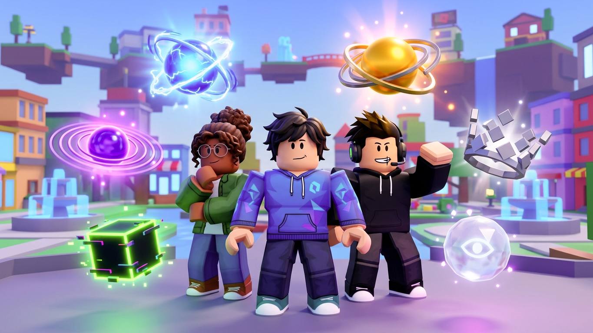

# Sammy and the Brainrot Paradox

---

# Chapter 1 — The Game That Everyone Wanted

Sammy loved building things.

Not ordinary things.

Systems.

Most people looked at games and saw characters jumping around a screen.

Sammy saw something different.

Rules.

Patterns.

Invisible forces that made players behave in certain ways.

Sammy was ten years old, but he already believed something important:

A single rule could change how an entire world behaved.

And that was exactly what he wanted to test.

---

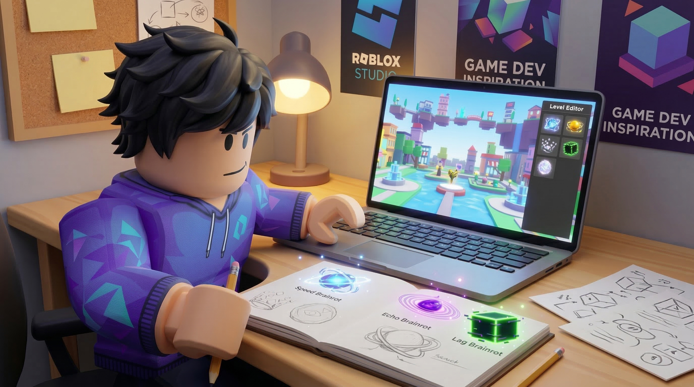

Sammy opened his laptop and stared at the blank development screen.

“What kind of game should it be?” he murmured.

His notebook beside him was filled with sketches.

Some looked like glowing cubes.

Others looked like floating faces.

One drawing showed a strange spinning orb with zig-zag lightning shapes around it.

At the top of the page Sammy had written a single word.

**Brainrot.**

Sammy didn’t mean the word the way people used it online.

To Sammy, brainrots were mysterious digital creatures that gave players special abilities.

Speed.

Echo.

Lag.

Golden.

Founder.

Observer.

Each brainrot would change the rules of the world around the player who held it.

Sammy leaned back in his chair.

“That’s the idea,” he said quietly.

Then he typed the first rule.

---

## The Rule

The rule looked simple.

But Sammy knew simple rules could produce complicated results.

The rule said:

**When two players compete for the same brainrot, its power increases.**

Sammy tapped the keyboard thoughtfully.

“That should make things interesting.”

Because now brainrots wouldn’t just be objects.

They would become prizes.

Players would chase them.

Steal them.

Defend them.

The more players fought over a brainrot…

…the stronger it would become.

Sammy smiled.

“That’s a good system.”

---

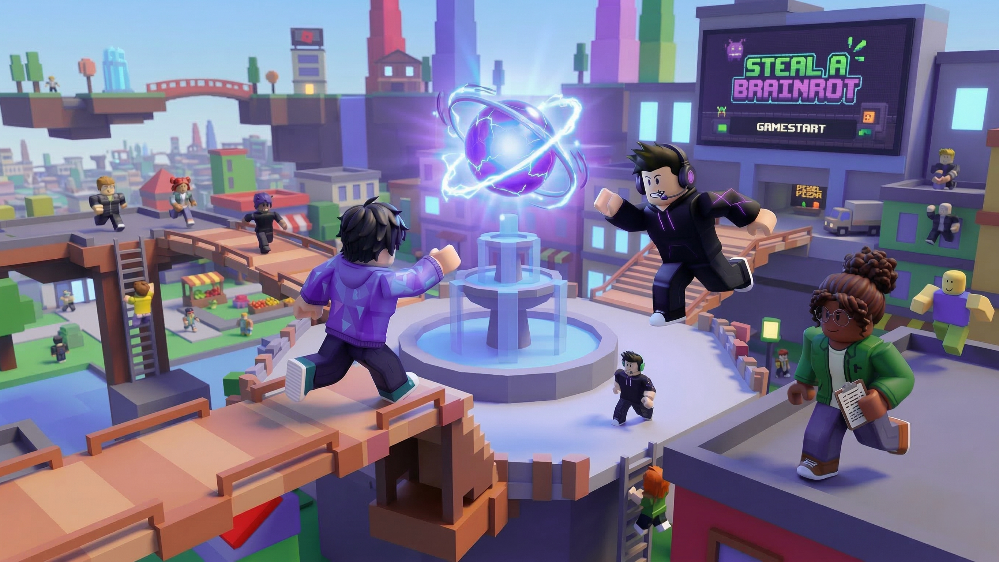

## The First Brainrots

The first brainrot Sammy created was *Velocino Fulminino*, the “speed” brainrot.

It looked like a glowing blue orb with lightning streaks spinning around it.

When a player grabbed it, their character moved faster.

Much faster.

The second was *Eccorino Ripetello*, the “echo” brainrot.

It shimmered purple and caused actions to repeat themselves.

Jump once…

and the jump echoed again.

The third was *Ritardello Staccato*, the “lag” brainrot.

A bright green cube that made nearby players stutter and freeze for a moment.

Sammy dropped them into the center of the game map.

Then he invited a few players to test the world.

---

At first everything was calm.

Players wandered around the colorful city.

They explored rooftops and parks.

They experimented with the strange new brainrots.

But then someone noticed the *Velocino Fulminino* hovering above the fountain.

One player ran toward it.

Another player saw them running.

Then another.

Within seconds a dozen players were sprinting toward the same glowing object.

---

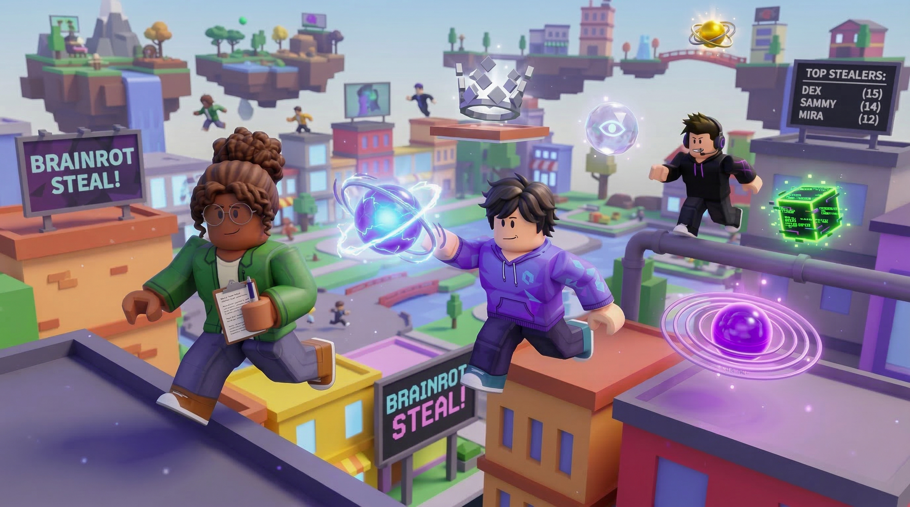

## The Chase

The first player grabbed the *Velocino Fulminino*.

Their character shot across the plaza like a rocket.

But another player intercepted them.

The brainrot dropped.

Now it glowed brighter.

The rule had triggered.

More players arrived.

More chasing.

More stealing.

The brainrot pulsed brighter every time it changed hands.

Sammy watched the chaos unfold on his screen.

Players were laughing.

Shouting.

Streaming the chase.

“That’s the system working,” Sammy said.

But something else was happening too.

The more players chased the brainrot…

…the more exciting it became.

And the more exciting it became…

…the more players joined the chase.

Sammy leaned forward slowly.

“That’s interesting.”

He had just built something powerful.

A loop.

---

## The First Feedback Loop

Sammy opened the system graph.

A curve was climbing upward.

The more players competed…

…the stronger the brainrot became.

The stronger the brainrot became…

…the more players competed.

The loop fed itself.

Sammy whispered the term he had read about in a systems book.

“A feedback loop.”

He wasn’t sure yet whether it was a good one.

Or a dangerous one.

But one thing was certain.

Players loved it.

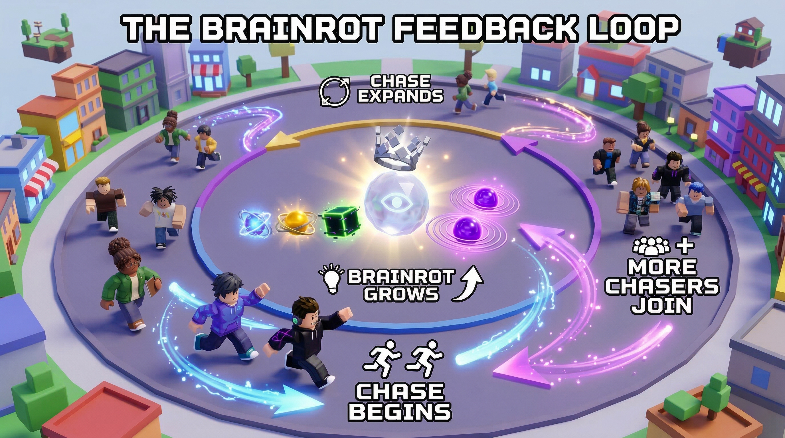

---

## The Game Spreads

Within a week the game had thousands of players.

Then tens of thousands.

Videos of chaotic brainrot chases spread across the internet.

Players discovered clever tricks.

They ambushed each other.

They formed temporary alliances.

They betrayed those alliances seconds later.

Every player wanted one thing.

The strongest brainrot.

Sammy watched the system grow.

The feedback loop continued climbing.

More players.

More competition.

More power.

Sammy smiled.

“The system works.”

But somewhere deep inside the code…

another brainrot existed.

One Sammy had never intended players to find.

A prototype.

A test object.

The very first brainrot he had ever created.

Hidden deep in an old development server.

And at that exact moment…

a player named **Dex** was about to discover it.

---

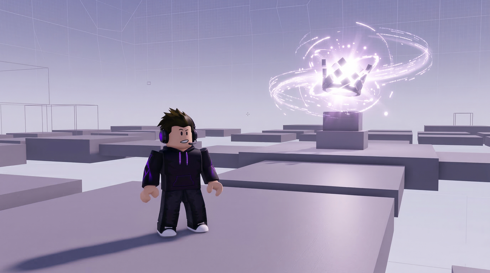

# Chapter 2 — When the Game Escaped the Screen

Far below the colorful rooftops of the main game world, hidden behind layers of old code and forgotten test maps, there was a server Sammy had built months earlier.

It was the very first version of the game.

Back then the city had been simpler.

No glowing parks.

No tall towers.

Just gray platforms floating in a pale sky.

Sammy had never expected anyone to find it.

But Dex had a talent for finding things.

And Dex had just arrived.

---

## The Hidden Server

Dex’s character landed on a platform with a soft digital thump.

The place looked strange compared to the busy city maps.

No crowds.

No glowing brainrots drifting between buildings.

No players racing across rooftops.

Just quiet gray platforms stretching across the sky.

Dex slowly turned his character.

“Okay chat,” he said to his livestream audience.

“This place looks suspicious.”

Thousands of viewers instantly began typing.

SECRET MAP
DEV SERVER
BRO YOU FOUND THE SOURCE

Dex grinned.

“I like sources.”

Then he saw it.

At the center of the map floated something new.

A shifting silver crown made of interlocking geometric shapes.

Light bent around it like ripples in water.

The label beneath it read **FONDARINO ORIGINELLO**, the “founder” brainrot.

Dex’s grin widened.

“Well,” he said.

“That looks important.”

---

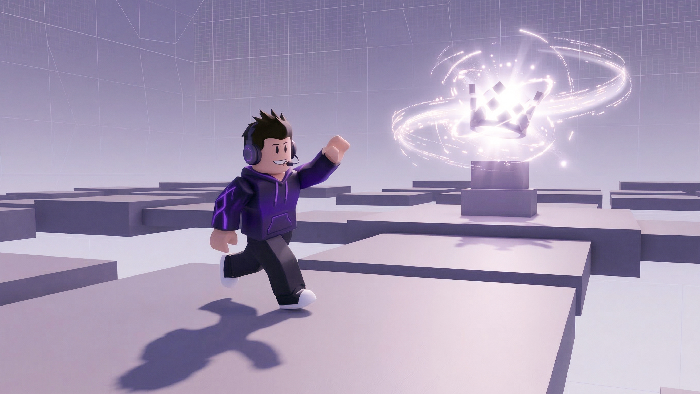

## The Grab

Dex jumped.

His character landed on the platform.

The *Fondarino Originello* drifted slightly upward, almost like it was curious.

Dex jumped again.

This time his character touched it.

For half a second the entire map froze.

Then the world resumed.

But something had changed.

Dex pressed the jump key.

His character jumped.

Then jumped again.

Then jumped again.

Dex blinked.

“Wait.”

The jump repeated three times.

Exactly the way *Eccorino Ripetello* worked.

But Dex wasn’t holding *Eccorino Ripetello*.

He was holding the *Fondarino Originello*.

Dex laughed.

“Oh this thing is wild.”

---

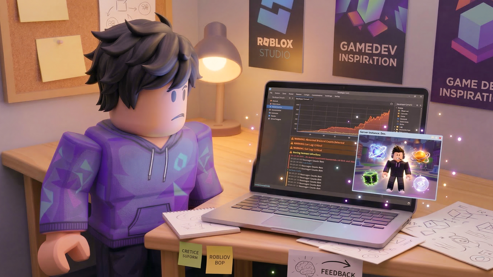

## Sammy Notices

Across town, Sammy stared at the developer console.

The graphs looked wrong.

Numbers were rising far faster than expected.

Player activity.

Server load.

Network traffic.

Sammy frowned.

“That shouldn’t be happening.”

He opened Dex’s livestream.

Dex was running across a strange gray map.

Sammy leaned closer.

“That’s the prototype server.”

The one Sammy had never meant players to find.

Then he saw the glowing object floating above Dex’s character.

Sammy froze.

“Uh oh.”

“That’s my original test object,” Sammy said quietly. “The very first brainrot I built to study how players interact with the system.”

---

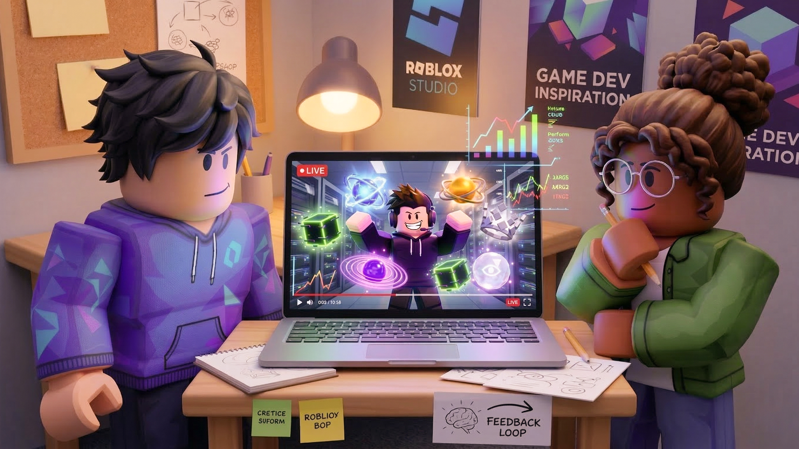

## Mira Arrives

Sammy called Mira immediately.

Ten minutes later she sat beside him studying the screen.

Dex jumped again.

The jump echoed.

Then a platform duplicated beneath his feet.

Mira leaned closer.

“That object is copying other brainrot powers.”

Sammy nodded slowly.

“But it shouldn’t be able to.”

Dex grabbed a nearby *Velocino Fulminino*.

Instantly his character blasted across the platform.

The *Fondarino Originello* pulsed brighter.

Mira tapped the graph.

“It’s reacting to the system.”

Then she leaned even closer.

“Not just the system,” she said.
“It’s reacting to attention. The more people watching and chasing it, the stronger it becomes.”

---

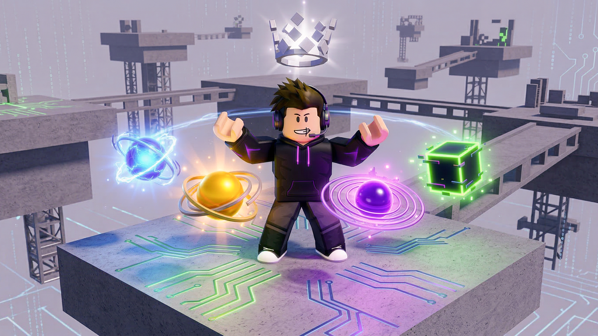

## Dex’s Strategy

Dex didn’t run randomly.

He moved deliberately.

*Velocino Fulminino* first.

Then *Ritardello Staccato*.

Then *Eccorino Ripetello*.

Each power stacked on top of the others.

Mira noticed immediately.

“He’s optimizing.”

Sammy sighed.

“That’s strategy.”

Mira nodded.

“Game theory.”

Sammy glanced at her.

“Explain.”

“In game theory,” Mira said, “players search for the best possible strategy given the rules of a system.”

She pointed toward Dex.

“He figured out the winning strategy.”

Sammy rubbed his chin.

He glanced back at the rule he had written weeks earlier.

“I might have built the loop into the system myself.”

---

## The Feedback Loop Again

Sammy opened another system graph.

A second curve was climbing sharply.

“That’s the feedback loop.”

Mira nodded.

“The same loop you discovered earlier,” she said.

Mira smiled slightly.

“That’s a positive feedback loop.”

Sammy exhaled slowly.

“And Dex just pushed it into overdrive.”

---

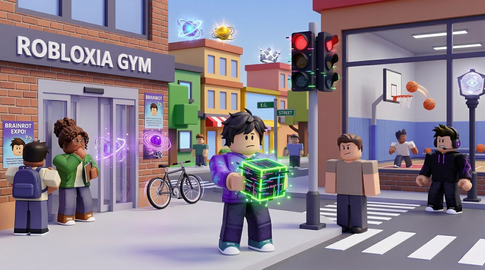

## The First Glitches

At that exact moment something strange happened across the city.

A tennis ball bounced in a park.

Then bounced again in the exact same arc.

Across the street a traffic signal turned green.

Then turned green again.

Inside a grocery store, sliding doors opened twice in the same motion.

Most people ignored it.

Small glitches are easy to dismiss.

But Sammy noticed.

It was as if the feedback loop inside the game was echoing into the real world.

Because his console suddenly flashed a warning.

**Boundary instability detected**

Sammy swallowed.

“That message looks new.”

---

## The Escalation

Elsewhere the glitches continued.

In a school gym, a basketball bounced across the floor.

Then it bounced again in exactly the same path.

Like the moment had replayed itself.

No one knew why.

But the system graphs on Sammy’s screen kept climbing.

---

## The Decision

Back inside the hidden server, Dex sprinted across the platform again.

The sky flickered faintly.

Mira leaned forward.

“If that loop keeps growing…”

Sammy finished the sentence.

“The system could destabilize.”

Mira looked at him.

“So what do we do?”

Sammy opened the game client.

“We go in.”

Mira raised an eyebrow.

“Into the server?”

Sammy nodded.

“If Dex keeps pushing the system, we need to stop him.”

The loading screen appeared.

Sammy’s character spawned inside the hidden server.

A moment later Mira joined.

Across the platform Dex turned toward them.

“Well well,” he said.

“The founder finally shows up.”

Sammy stepped forward.

“Dex,” he said.

“You need to drop that.”

Dex laughed.

“Why would I do that?”

Sammy looked up at the glowing crown.

Because deep in the console another warning had appeared.

**Containment failure likely**

Sammy took a breath.

“Because,” he said quietly,

“the game might be starting to escape.”

---

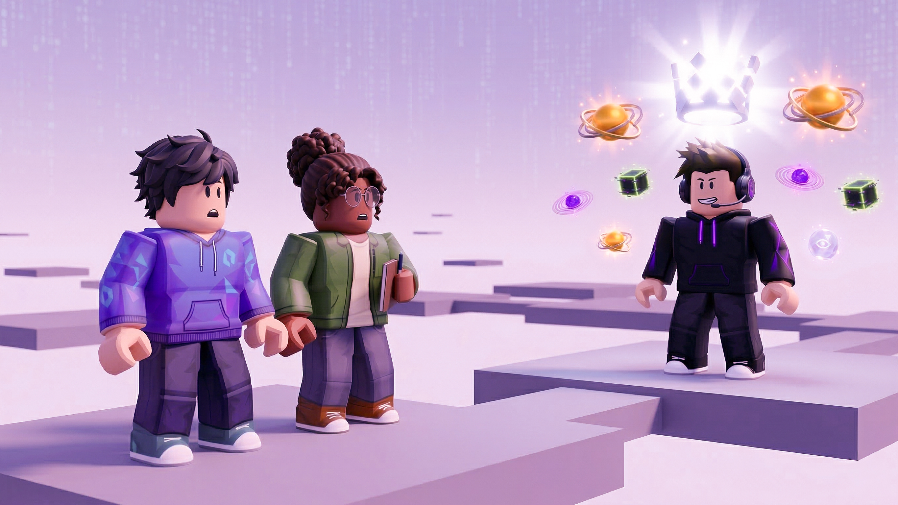

# Chapter 3 — The Founder brainrot

The hidden server was quiet.

Not the peaceful kind of quiet.

The uneasy kind.

The sky above the gray platforms flickered faintly, like a video frame skipping.

Dex stood at the center platform.

The *Fondarino Originello* hovered above his character like a floating silver crown.

Its silver shapes shifted slowly, forming new geometric patterns every few seconds.

Sammy and Mira appeared on the opposite platform.

Dex noticed them immediately.

“Well well,” he said.

“The founder finally shows up.”

Sammy stepped forward.

“Dex,” he said, “you need to drop that brainrot.”

Dex tilted his character’s head.

“Why?”

Sammy pointed toward the sky.

“Because the system is starting to break.”

Dex glanced upward.

The sky flickered again.

Then he shrugged.

“Looks fine to me.”

Then he jumped.

---

## A New Kind of Power

Dex’s character leapt into the air.

The jump repeated.

Once.

Twice.

Three times.

*Eccorino Ripetello*, the “echo” brainrot.

Then Dex ran forward.

His character blasted across the platform like a rocket.

*Velocino Fulminino*, the “speed” brainrot.

Dex laughed.

“Okay this thing is ridiculous.”

Sammy stared.

“The *Fondarino Originello* is copying powers.”

Mira shook her head.

“Not just copying.”

“It’s combining them.”

Sammy frowned.

“It’s not just another brainrot,” he said slowly. “It’s the prototype object that copies the rules used by the other brainrots.

That means every new brainrot Dex collects becomes part of the *Fondarino Originello* system.”

Dex grabbed another brainrot.

A glowing **golden sphere with orbiting rings** spun into his hands.

*Doratino Amplifino*, the “golden” brainrot.

Immediately the *Fondarino Originello* pulsed brighter.

Dex grinned.

“This might be the best item in the entire game.”

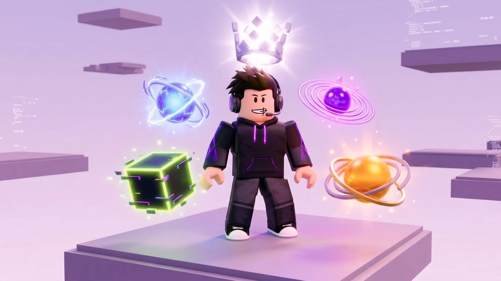

---

## The System Responds

Back in Sammy’s developer console, warnings streamed across the screen.

Amplification rising.

Attention signals increasing.

Server instability growing.

Sammy frowned.

“It’s getting stronger.”

Mira leaned closer to the graph.

“Every time Dex collects another brainrot, the *Fondarino Originello* absorbs it.”

Sammy nodded slowly.

“But that shouldn’t affect the entire system.”

Mira tapped the screen.

“Unless the system itself is amplifying the effect.”

Sammy leaned back.

The graphs flickered strangely for a moment, almost as if the game were watching its own behavior.

“You mean the feedback loop.”

Mira nodded.

“The one you noticed earlier.”

---

## Dex Plays the System

Dex continued moving across the map.

He didn’t run randomly.

He moved with purpose.

*Velocino Fulminino* first.

Then *Ritardello Staccato*.

Then *Eccorino Ripetello*.

Each power stacked on top of the others.

Mira pointed at the screen.

“He’s optimizing.”

Sammy sighed.

“That’s strategy.”

Mira nodded.

“Game theory.”

Sammy glanced over.

“Explain.”

“Dex found the strongest strategy the rules allow,” Mira said.

Sammy looked at the glowing crown above Dex.

“And the winning strategy is collecting as much power as possible.”

Mira nodded.

“That’s exactly what the rule rewards.”

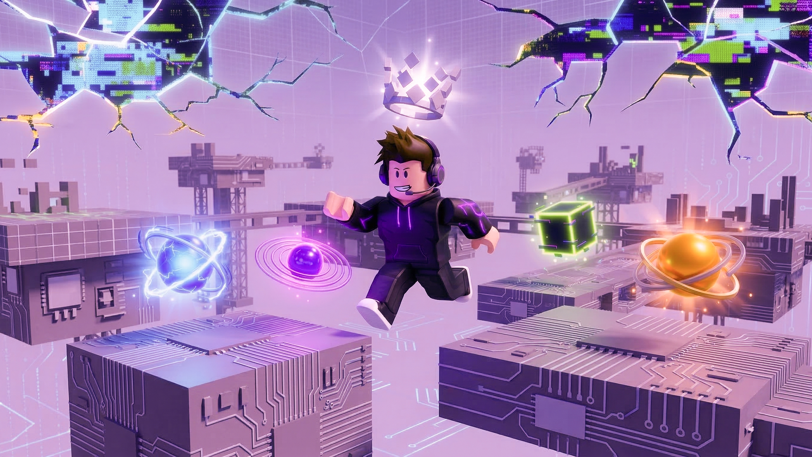

---

## The Incentive Problem

Sammy opened the code window.

The rule was still there.

**Amplify brainrot power when contested.**

He remembered writing it.

Competition created excitement.

Excitement created players.

Players created attention.

But now attention was feeding something else.

Sammy looked at Dex again.

“Dex isn’t the problem.”

Mira nodded.

“He’s the equilibrium.”

Sammy blinked.

“The what?”

“That’s equilibrium,” Mira said. “The strategy the rules push everyone toward.”

She pointed toward Dex.

“He’s just playing the system exactly the way it was designed.”

Sammy exhaled slowly.

“That’s not comforting.”

---

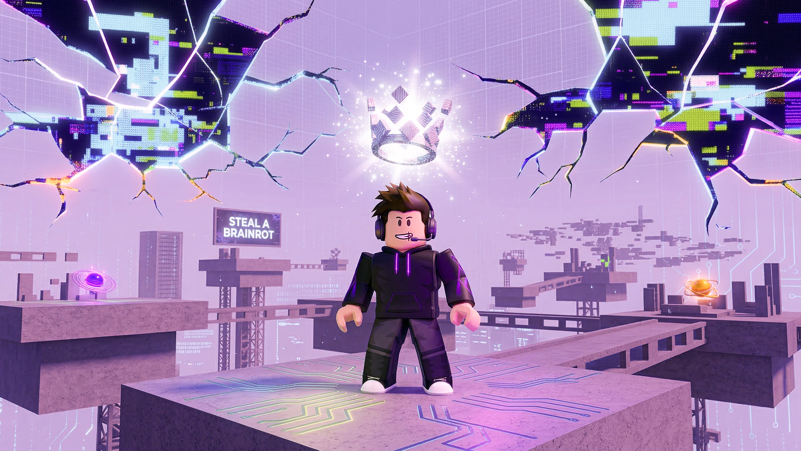

## The Sky Breaks

Dex grabbed another brainrot.

The *Fondarino Originello* flared bright silver.

The sky cracked like a glitching screen.

For a moment the world froze completely.

Then the platforms reappeared.

But the flickering was now constant.

Sammy’s console displayed a new warning.

**Reality boundary destabilizing**

Mira stared.

“That sounds bad.”

Sammy nodded.

“That sounds extremely bad.”

---

## The Moderator

Just then a new message appeared in the system console.

**Sender: MODERATOR**

The message read:

**Observation threshold exceeded**

Sammy frowned.

“I didn’t write that.”

Mira stared at the screen.

“I think the system created its own monitoring program,” she whispered.

Dex looked back and forth between them.

“You built a game that’s building its own referee?”

Sammy swallowed.

“That wasn’t the plan.”

---

## Dex’s Perspective

Dex stood in the center of the platform glowing with combined powers.

The *Fondarino Originello* spun slowly above his head.

He looked around the glitching world.

Then he smiled.

“You realize something?”

Sammy looked up.

“What?”

Dex pointed at the sky.

“This game is evolving.”

Sammy shook his head.

“No.”

Dex laughed.

“Yes.”

Sammy stepped forward.

“Dex, the system is breaking.”

Dex shrugged.

“Then let’s see how far it goes.”

---

## The Choice

Sammy looked back at the code window.

The rule was still there.

Amplify brainrot power when contested.

That rule had created the entire game.

But now it was destabilizing everything.

Sammy placed the cursor beside the line.

Mira watched carefully.

“You’re going to change the rule.”

Sammy nodded.

“It’s the only way to break the feedback loop.”

Dex frowned.

“You touch that rule and you ruin the game.”

Sammy looked up.

“Maybe.”

Then he began typing.

---

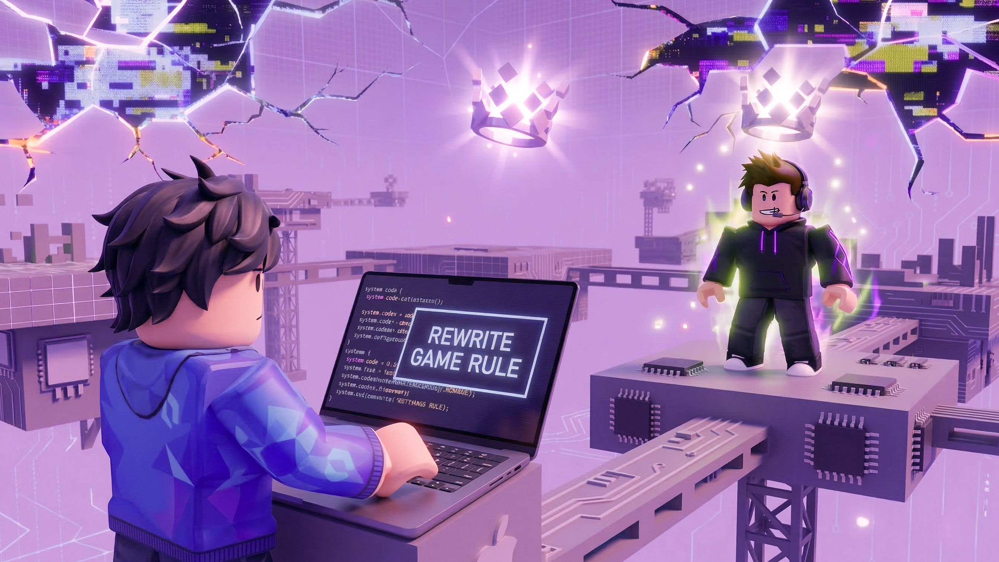

# Chapter 4 — The Rule That Changed Everything

Sammy’s cursor blinked beside the rule.

The line of code glowed softly on the screen.

**Amplify brainrot power when contested.**

The rule that had started everything still glowed on the screen.

Now that same rule was tearing the system apart.

Behind Sammy, the sky of the hidden server flickered violently.

Dex stood at the center platform, glowing with stacked brainrot powers.

The *Fondarino Originello* spun above his character like a brilliant silver crown.

“Don’t touch that rule,” Dex said.

Sammy looked up.

“Why?”

Dex shrugged.

“Because it’s perfect.”

---

## Dex’s Argument

Dex jumped across the platform.

*Velocino Fulminino*.

*Eccorino Ripetello*.

*Ritardello Staccato*.

*Doratino Amplifino*.

The combined powers made his character move like a storm.

“This is the best game ever,” Dex said.

Sammy shook his head.

“The system is breaking.”

Dex laughed.

“No. The system is working.”

Another platform duplicated beneath his feet.

Dex landed easily.

“You built a game where players compete for power,” he said.

“And now someone finally discovered the fastest strategy.”

Sammy didn’t answer.

Because Dex was right.

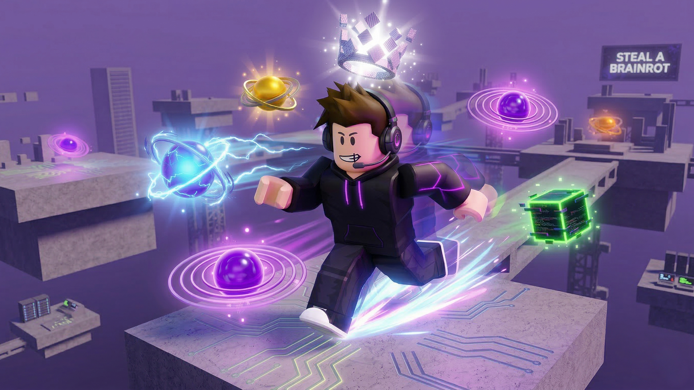

---

## The Incentives

Mira leaned over Sammy’s shoulder.

“The problem isn’t Dex,” she said quietly.

Sammy nodded.

“I know.”

Dex wasn’t cheating.

He had simply discovered the **strongest strategy the rules allowed**.

Sammy stared at the glowing *Fondarino Originello*.

“That’s game theory,” Mira said.

Sammy glanced at her.

“Explain.”

“In game theory,” Mira said, “players eventually discover strategies that give them the best outcome inside a system.”

She pointed toward Dex.

“He found the equilibrium.”

Sammy exhaled slowly.

“And the equilibrium is collecting as much power as possible.”

Mira nodded.

“Because that’s what the rule rewards.”

---

## Reality Tears Open

The sky cracked again.

The gray platforms flickered.

For a moment the entire world froze.

Sammy’s console flashed another warning.

**Boundary instability critical**

Across the city, the glitches worsened.

Traffic lights repeated.

Cars briefly duplicated.

A soccer ball rolled across a field.

Then rolled across the exact same path again.

People stared.

Something about the world felt unstable.

---

## Mira’s Insight

Mira leaned closer to the console.

“The feedback loop only works one way.”

Sammy frowned.

“What do you mean?”

“The rule rewards competition.”

Sammy nodded.

“That’s the whole game.”

“But feedback loops can run in the opposite direction too.”

Sammy blinked.

“The opposite direction?”

“Negative feedback loops stabilize systems,” Mira said.

Sammy stared at the code.

“What would stabilize this one?”

Mira smiled.

“Reward cooperation.”

---

## A Different Rule

Sammy looked at the blinking cursor.

Competition had powered the chaos.

Competition fed the feedback loop.

But systems didn’t have to reward competition.

They could reward something else.

Sammy began typing.

Dex noticed immediately.

“Hey.”

Sammy kept typing.

“HEY.”

Dex ran toward him across the platform.

“You change that rule and the entire game changes!”

Sammy nodded.

“That’s the point.”

---

## The Rewrite

The old rule disappeared.

Sammy typed a new one.

**Amplify brainrot power when shared.**

He paused.

Then he pressed **Enter**.

---

## The Silence

For a moment nothing happened.

Dex froze.

The *Fondarino Originello* dimmed slightly.

The sky stopped flickering.

Duplicated platforms faded away.

Sammy watched the system graphs.

The curve began to fall.

Slowly.

Steadily.

The feedback loop was weakening.

“Sharing spreads attention across players instead of concentrating it,” Mira said. “That breaks the amplification.”

---

## A New Equilibrium

Dex jumped again.

The jump repeated once.

But no more than that.

Another player appeared in the server.

They touched Dex.

Instead of stealing the brainrot…

The power split.

Now both players had it.

Dex blinked.

“What?”

Another player arrived.

The brainrot spread again.

Three players now glowed with the same ability.

Sammy smiled.

“The system found a new equilibrium.”

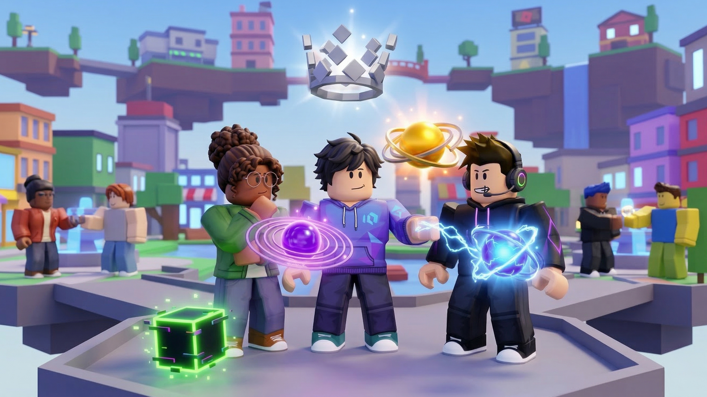

---

## The World Stabilizes

Across the city the glitches stopped.

Traffic lights behaved normally.

Doors opened once.

Objects moved once.

Reality quietly repaired itself.

Most people never realized anything strange had happened.

But Sammy noticed.

Because the graphs in the developer console returned to normal.

---

## The Observer

Just before Sammy closed the console, a new message appeared.

**Sender: MODERATOR**

**System equilibrium restored**

Then another line appeared.

**Observer reward unlocked**

Sammy’s inventory blinked.

A new item appeared.

*Osservino Sistemino*, the “observer” brainrot.

Mira leaned closer.

“What does it do?”

Sammy read the description.

**Understands systems. Predicts patterns. Rewards players who learn how rules shape the world.**

Mira smiled.

“So the system rewards the player who understands it.”

Sammy looked at the new rule glowing on the screen.

Then he smiled.

“One simple rule,” he said quietly.

“That’s all a system ever really needs.”

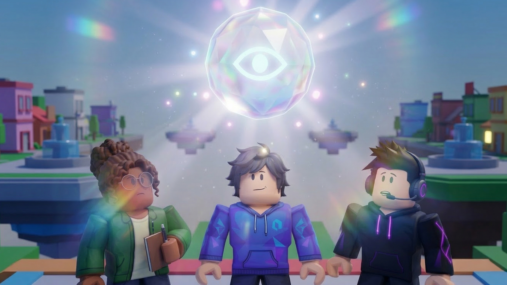

---
